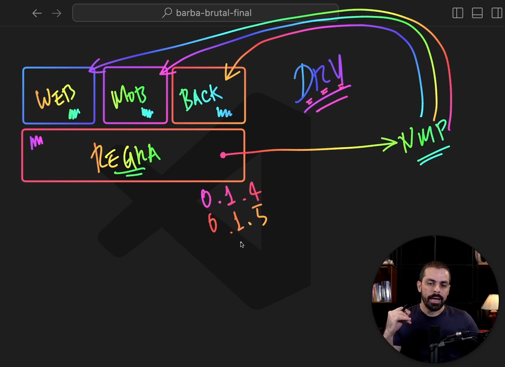

## NOTES

 

### O que é Monorepo e Turbo Build ?

Você pode ler sobre [como criar um monorepo utilizando o Turborepo](https://vinniciusgomes.medium.com/como-criar-um-monorepo-utilizando-o-turborepo-11b21a3dcfd9).

Mais informações no [site oficial Turbo Build](https://turbo.build/).

 

 

### Comandos 

Criar um novo projeto com Turbo:

    
    npx create-turbo@latest barba-brutal
    

Navegar para o diretório do projeto e para a pasta `apps`:

    
    cd barba-brutal
    cd apps
    

Criar um aplicativo Next.js:

    
    npx create-next-app@latest frontend
    

Instalar o CLI do NestJS e criar um novo backend:

    
    npm install -g @nestjs/cli
    nest new backend
    

Criar um aplicativo Expo:

    
    npx create-expo-app@latest mobile
    

